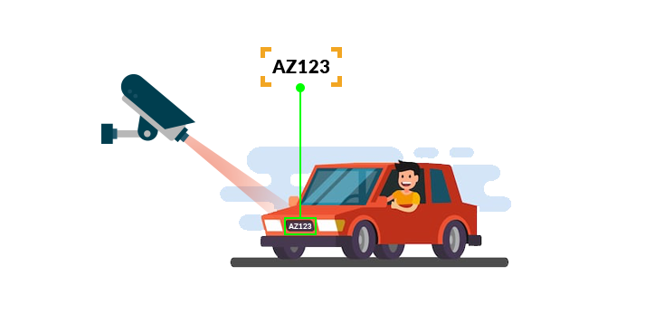

# 🚗 License Plate Recognition from Video

A simple AI-powered project that detects and reads vehicle license plates from video using **Python**, **OpenCV**, and **EasyOCR**. It extracts frames from a video, isolates license plate regions using image processing, and recognizes the text using OCR.

---

## 🔍 Features

- Extracts frames from input video
- Detects and isolates license plate regions using OpenCV
- Reads plate numbers using EasyOCR
- Visualizes processed results with bounding boxes and text overlay

---

## 🛠️ Techniques Implemented

- **Edge Detection** using Canny to highlight significant boundaries
- **Contour Extraction** to identify possible plate regions
- **Polygon Approximation** to find rectangular shapes
- **Masking and Cropping** to isolate the license plate from background
- **Text Recognition** using EasyOCR for plate number extraction
- **Result Overlay** with bounding boxes and recognized text

---
